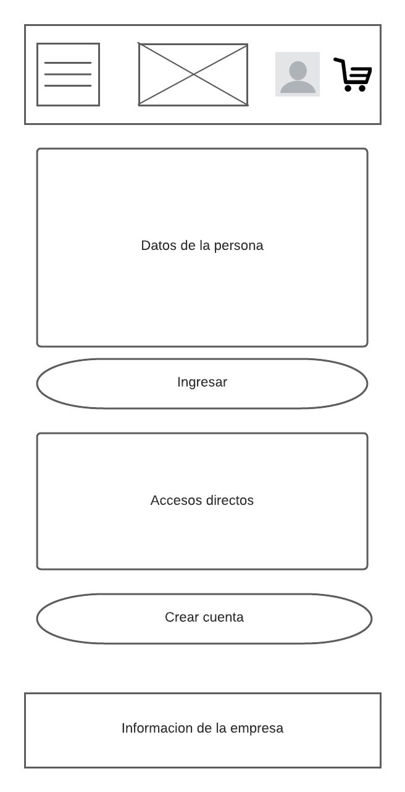
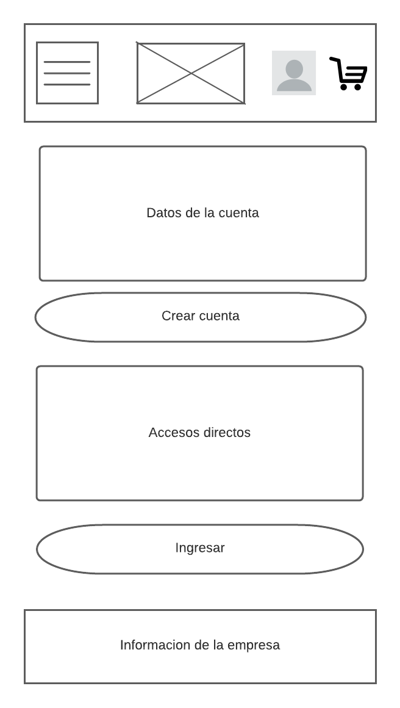

# Proyecto integrado: human
## Descripcion
    Para este proyecto se va a diseñar una pagina weg para una tienda de relojes, cadenas y billeteras. La empresa en la actuailida tiene un intagram. los intengrantes de este proyecto son: Agustin Enriquez, Yamila Bogarín, Francisco Lema, Federico Fores

## Creacion de los wireframe
- Pagina de incio : <a href="https://vincerocollective.com"> vincero </a>
- Pagina de reloj y tienda: <a href = "https://abaco.la/shop/enrico-toffee/"> abaco </a> 

- Detalle del preocuto: <a href = "https://abaco.la/shop/colt-acero/"> abaco </a> / <a href = "https://www.valkur.com.ar/productos/reloj-varallx/"> valkur </a>

- Carrito de compras:  <a href = "https://vincerocollective.com/pages/international-checkout#Global-e_International_Checkout"> vincero </a> 

- Formulario de registro: <a href = "https://www.valkur.com.ar/account/register/"> valkur y </a> <a href = "https://vincerocollective.com/account/register"> vincero </a>

- Formulario de login: <a href = "https://abaco.la/my-account/edit-account/"> Abaco</a>

## Estilos de la marca

### Logo:  

  

### Textos con serifa:  
  

### Todo el resto
  

### Colores:
#### Principal
  
#### Destacar
  

#### Paleta de colores <Esto aun no se decidio>

  

## wireframe
### Home
#### Computadora 
  

#### Celular
  

### Productos
#### Computadora
  

#### Celular
   cambiar

### Registro
#### Computadora
 

#### Celular
 

### Login
#### Computadora

#### Celular

### Carrito
#### Computadora

#### Celular

# Metodologia de desarrollo

Nuestro metodologia de desarrollo se va a basar en una reunion principal (por sprints) y reuniones semanales para ver el avance de nuestro trabajo.
## Tablero de trabajo

Para nuestro tablero de trabajo estaremos usando la plataforma Trello con el link  
<a href = "https://trello.com/b/TzbIGMPS/proyecto-integrador">Nuestro Tablero</a>